---
header-includes:
  - \usepackage{float}
  - \let\origfigure\figure
  - \let\endorigfigure\endfigure
  - \renewenvironment{figure}[1][]{\origfigure[H]}{\endorigfigure}
---


# Projet Logiciel Transversal: SmallWorld
---

#### Julien METZELARD – Tarek TALSI – Maël ARCHENAULT – Victor MOREL

---

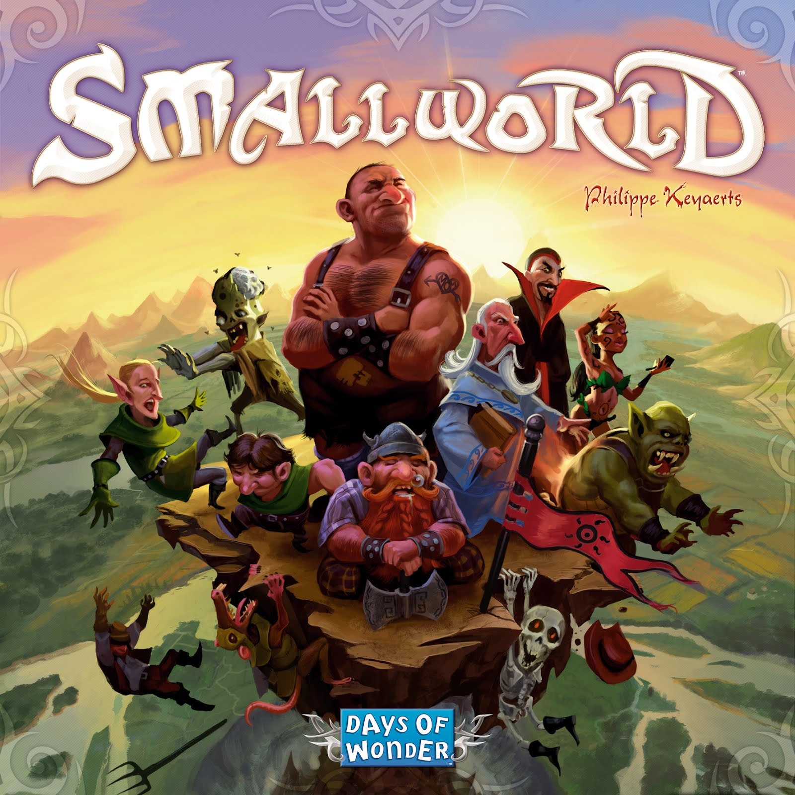


## 1 Objectif

### 1.1 Présentation générale

L'objectif de ce projet est de créer une version numérique du jeu de plateau "SmallWorld". Le projet est mené par 4 étudiants. Le jeu est codé en C++.

### 1.2 Règles du jeu

Le jeu choisi est un jeu de stratégie en tour par tour. Pour gagner, les joueurs doivent avoir à la fin du jeu le plus d'argent.

SmallWorld se joue grâce à un plateau représentant une carte de territoires, et des pions faisant office de troupes. Lorsque son tour arrive, le joueur doit attaquer les territoires de ses adversaires afin de conquérir un maximum de terrain. A la fin de son tour, il reçoit autant d'argent que de terrains qu'il possède.

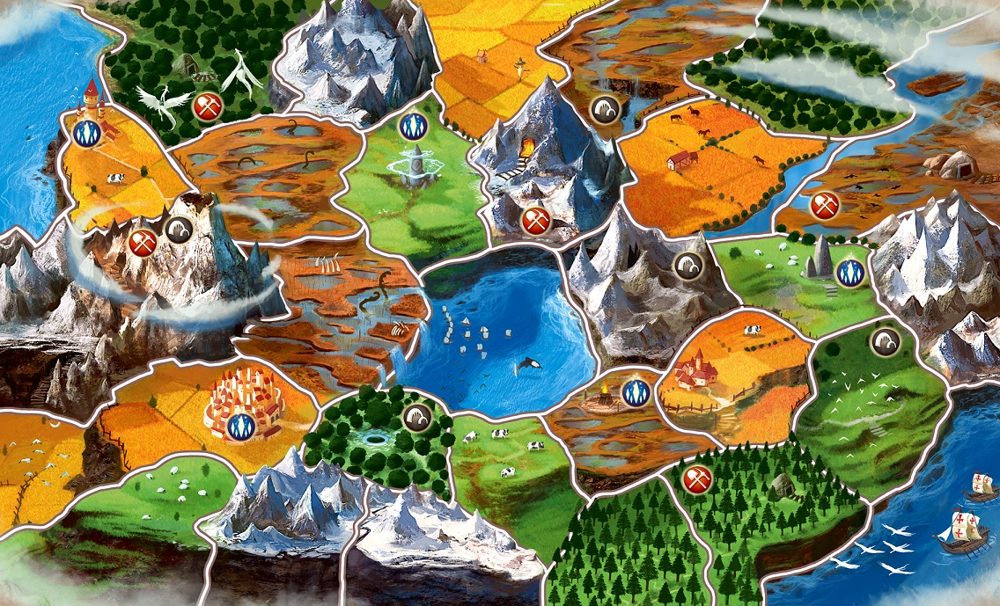


À ces mécaniques de bases s'ajoutent des systèmes de pouvoirs. Chaque joueur choisit une "espèce" pour ses troupes ainsi qu'un "pouvoir". Les combinaisons espèce/pouvoir sont définies de manière aléatoire. Chaque espèce a un effet différent, de même pour les pouvoirs. Cela peut aller d'un bonus de troupes lors d'un attaque à un bonus de récompense à la fin du tour. Les pouvoirs sont très variés.

Chaque joueur peut, s'il le veut, abandonner son espèce actuelle et en prendre une nouvelle. L'espèce abandonnée reste sur le plateau, mais est marquée comme "en déclin". Les territoires occupés par une espèce en déclin rapportent toujours des récompenses à son ancien propriétaire.

Tout l'intérêt du jeu réside dans la capacité à changer d'espèce au bon moment, et à choisir la bonne combinaison espèce/pouvoir parmi celles proposées.


### 1.3 Conception Logicielle
Dépendances :
- git
- dia
- cmake
- g++
- lcov
- gcovr
- libxml2-dev
- libsfml-dev
- libboost-test-dev
- microhttpd-dev

## 2 Description et conception des états

### 2.1 Description des états

L’état global du jeu est centralisé dans la classe Game_State, qui contient toutes les informations nécessaires pour décrire la partie à un instant donné :

- la carte (Map) contenant l’ensemble des informations sur les zones de la carte avec ses specificités ainsi que les troupes des joueurs 
- la liste des joueurs (Player),
- les tribus (combinaison d'espèce et de pouvoir) disponibles via une pile (Tribe_Stack),
- des paramètres de gestion de tour comme le nombre de joueur actif ainsi que le nombre de rounds.

Chaque Player représente un joueur de la partie et possède :

- un identifiant unique,
- un nom
- un emplacement pour une tribu active,
- un emplacement pour une tribu en déclin
- une quantité d'argent,
- les méthodes associées à la conquête ou au déploiement d’unités.

Une Tribe correspond à la combinaison d’une espèce et d’un pouvoir spécial, ce qui définit les capacités et bonus de la tribu. Chaque Tribe possède :

- un nombre d’unités disponibles,
- des descriptions (Species_Description, Power_Description) déterminant ses effets,
- des méthodes associé aux tribes comme go_in_decline et autre qui seront explicités plus tard.

Les zones (Area) modélisent les régions de la carte. Elles contiennent :

- un biome (Area_Biome) et éventuellement des spécial tokens (forteresse, tanière, etc.),
- une liste de voisins, pour représenter les connexions de la carte,
- un propriétaire (Tribe), ici il est important que le propriétaire soit une Tribe et non pas un Player car un Player peut avoir plusieurs Tribe et que ces Tribe peuvent s'attaquer mutuellement,
- et des méthodes permettant la conquête ou le déploiement d’unités.

L’ensemble de ces zones est géré par la classe Map, qui stocke leur liste et permet le chargement depuis un fichier JSON (utilisé pour initialiser la carte).

Les pouvoirs spéciaux peuvent être déclenchés à différents moments du tour (début de tour, conquête, redéploiement, etc.). Nous avons donc choisi de créer une interface Effects_Bundle qui définit les fonctions abstraites suivantes :
- first_gather_effect
- conquest_prices_effect
- conquest_effect
- second_gather_effect
- redeploy_effect
- rewards_effect
- lose_effect
- decline_effect
- disappearing_effect

Dans la grande majorité des cas, ces fonctions n'ont aucun effet. Les pouvoirs et espèces surchargent ces méthodes pour ajouter les effets qui les concernent (Exemple: les nains modifient le rewards_effect).

Les classes concrètes de pouvoirs et d'espèces héritent des Power_Description et Species_Description, qui héritent elle-mêmes de l'Effect_Bundle.


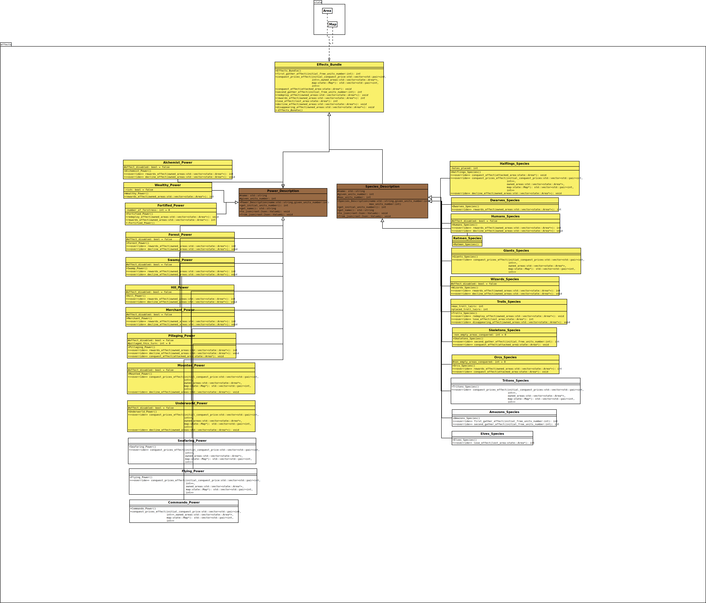

### 2.2 Conception logicielle

Le diagramme UML présente l’architecture des classes du module state.
L’organisation suit une approche orientée objet modulaire (plus que cruciale dans notre cas avec autant d'effet différent) :

- Game_State joue le rôle de façade, offrant un point d’entrée unique pour manipuler l’état global du jeu.
- Map et Area forment le modèle spatial, décrivant la topologie/état physique du monde.
- Player et Tribe constituent le modèle des acteurs de ce monde, reliés entre eux par composition.


L'architecture du système centralise l'état global du jeu dans la classe Game_State, qui regroupe toutes les informations essentielles pour décrire la partie à un moment donné ce qui en fait une facade qui sera utile pour la suite. La carte (Map) agrège plusieurs zones (Area) connectées entre elles, offrant ainsi une structure modulaire qui reflète la topologie du monde de jeu. Cette modulation potentielle est importante car la map n'est pas un objet fixé sans modification. Des special token venant de pouvoir de classe modifient cette map. La classe contient également la liste des joueurs (Player), ainsi que les tribus, qui combinent espèces et pouvoirs, accessibles via une pile (Tribe_Stack). En outre, des paramètres de gestion des tours, tels que le nombre de joueurs actifs et le nombre de rounds, sont également inclus, garantissant une interface pour la manipulation de l'état du jeu. La hiérarchie d'Effects_Bundle encapsule divers comportements d'effets appliqués aux tribus, permettant une flexibilité dans la gestion des capacités spécifiques comme vu précedemment.


### 2.3 Conception logicielle: extension pour le rendu

Comme vu avec nos encadrants, l’architecture du module state est conçue pour être indépendante de l'engine.
Les classes ne contiennent aucune logique d’affichage ni de physique pur du jeu ; elles ne stockent que des données et des états.
L'intérêt de cette séparation est de ne pas exposer la structure interne de notre state dans le cas où ne serions amené à changer quelque chose, il ne faut pas que ces changements impactent la façon dont l'engine appele le state.
Le module de rendu peut donc interagir avec cet état via des interfaces de lecture (ex. : positions des tribus, nombre d’unités sur chaque zone, propriétaire d’une zone, etc) sans altérer la logique du jeu.


### 2.4 Conception logicielle: extension pour le moteur de jeu

Le moteur de jeu utilise le module state comme base de données dynamique.
Il peut :

- appeler les méthodes Game_State::conquer(), Player::redeploy_units(), ou Area::set_owner() pour faire évoluer la partie,
- interroger l’état courant pour déterminer les actions possibles,
- notifier le module de rendu pour mettre à jour l’affichage.

Cette conception permet une séparation claire entre la logique du jeu et les actions du joueur qui par ailleurs rend le projet facilement testable via des tests unitaires.

### 2.5 Diagramme UML

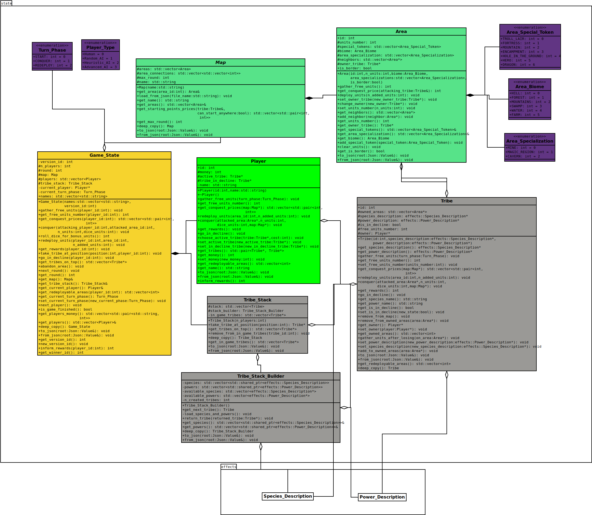


 
## 3 Rendu: Stratégie et Conception
### 3.1 Stratégie de rendu d'un état

Le jeu possède différentes structures assez différentes à afficher:

- **la carte de jeu** : Map 

- **les pions posés sur les territoires** : Units, Special_Tokens, etc ... 

- **la pioche d'espèce** : Tribe_Stack 

- **la main du joueur** : Money, Free_Units, Tribes 

Pour afficher ces différentes structures, nous avons choisi de créer une classe Renderer qui va s'occuper de tout le rendu graphique du jeu. Cette classe va utiliser la bibliothèque SFML pour afficher les différentes structures du jeu.

Chaque structure va avoir une classe dédiée à son affichage. Cela permettra une meilleure organisation du code et une meilleure réutilisabilité.

### 3.2 Conception logicielle

Voici une description des classes principales utilisées pour le rendu:

### Token_Renderer  

Cette classe est responsable du rendu des tokens (unités, special tokens, area_specialization) sur la carte. C'est une brique de base utilisée dans d'autres classes de rendu (Map_Renderer et Player_Area_Renderer)

Avant de rendre l'objet sur une fenêtre de rendu, on peut changer ce qu'il représente:

- pour des pions: l'espèce sur le pion
- pour des special_tokens: le type de special_tokens
- pour des area_specialization: le type d'area_specialization

Il est aussi possible d'ajouter un nombre sur le côté de l'affichage du pion pour représenter le nombre d'unités présentes sur la zone.

### Tribe Renderer  

Cette classe est responsable du rendu des tribes. Une tribe est affichée grâce à deux cartes:

- une carte de pouvoir
- une carte d'espèce

Ce moteur de rendu est capable de rendre l'ensemble des deux cartes (en les fixant l'une par rapport à l'autre).


### Map Renderer  

Cette classe est responsable du rendu de la carte de jeu. Elle utilise la classe Token_Renderer pour afficher les unités et les special tokens sur chaque zone de la carte.

La carte de jeu est stockée sous la forme d'une image associée avec un fichier json représentant les positions des différentes zones.
Le rendu de la carte se fait en deux étapes:
- on affiche l'image de la carte
- on affiche les unités et les special tokens sur chaque zone grâce à la classe Token_Renderer

### Player Area Renderer  

Cette classe est responsable du rendu de la main d'un joueur donné. Elle utilise la classe Token_Renderer pour afficher les unités que le joueur possède dans sa main. De même la classe Tribe_Renderer est utilisée pour afficher les tribes que le joueur possède.

La classe Player_Area_Renderer possède une référence vers la Map qu'elle affiche.

Trois choses sont affichées par ce moteur de rendu:
- l'argent du joueur
- les unités libres du joueur
- les tribus que le joueur possède (dont celles en déclin)


### Tribe Stack Renderer  

Cette classe est responsable du rendu de la pioche d'espèces. Elle utilise la classe Tribe_Renderer pour afficher les tribus disponibles dans la pioche.

La classe Tribe_Stack_Renderer possède une référence vers la Tribe_Stack qu'elle affiche.

Ce moteur de rendu afficher les 6 tribus de la pioche auquel le joueur a accès. Il ajoute à leur côté le prix de retrait de la tribu.

### Autres
Le rendu principal intègre aussi des éléments d'interface utilisateur comme des boutons, des textes, etc ... Ces éléments sont gérés directement dans différentes classes comme Area_Info_Renderer (affichage des informations d'une zone) ou encore l'Overlay_Renderer (affichage de surlignages sur la carte).


### Renderer  

Cette classe est responsable du rendu global du jeu. Elle utilise les différentes classes de rendu pour afficher l'état actuel du jeu.


### 3.3 Ressources

L'ensemble des ressources est stockée sous forme de spritesheet. Les classe s'occupent ensuite de d'afficher seulement une partie rognée de la spritesheet. Pour cela, elles s'aident de fichier nommes "indexing" qui leur indiquent où trouver chaque sprite dans la spritesheet.

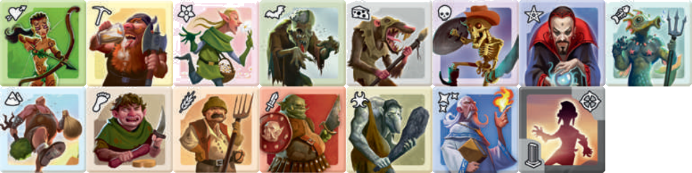


Exemple de fichier de type "indexing"

```json
{
  "sprite_size": [150, 150],
  "frames": {
    "Amazons":  [0,0],
    "Dwarves":  [0,1],
    "Elves":  [0,2],
    "Ghouls": [0,3],
    "Ratmen":  [0,4],
    "Skeletons":  [0,5],
    "Sorcerers":  [0,6],
    "Tritons":  [0,7],
    "Giants":  [1,0],
    "Halflings":  [1,1],
    "Humans":  [1,2]    ,
    "Orcs": [1,3],
    "Trolls":  [1,4],
    "Wizards":  [1,5],
    "Lost Tribe":  [1,6]
  }
}
```

### 3.4 Exemple de rendu

A l'aide de la classe Renderer, il est possible de rendre l'état complet du jeu.

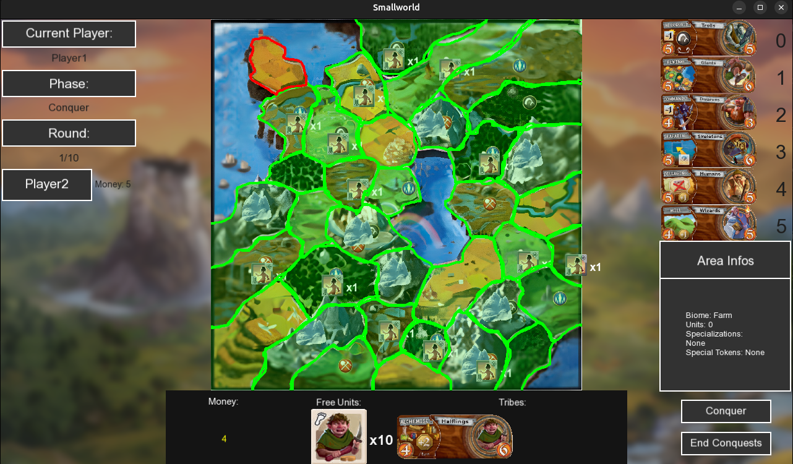


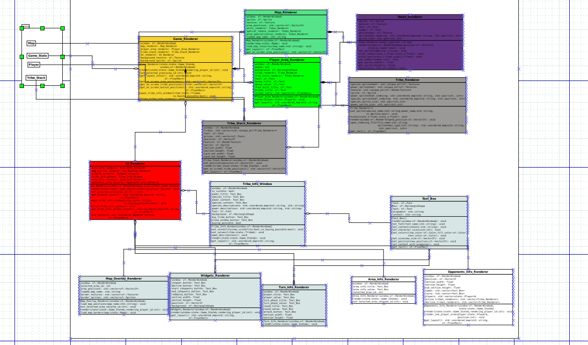

## 4 Règles de changement d'états et moteur de jeu

### Vue d'ensemble

Le moteur de jeu (« Engine ») est la couche responsable de l'exécution des actions des joueurs sur l'état de la partie (`state::Game_State`). Il ne contient pas la logique métier des règles (qui reste dans `Game_State`, `Area`, `Player`, etc.), mais orchestre l'application ordonnée des commandes produites par l'interface joueur, l'IA ou les tests.

Principales responsabilités :
- recevoir et mettre en file (FIFO) des commandes via `add_command()` ;
- valider la légitimité d'une commande par rapport à l'état courant (joueur courant, phase de tour, présence d'une tribu active, ...);
- exécuter la commande en appelant `command->execute(state)` ;
- gérer la file de commandes (suppression après exécution, possibilité d'annuler la commande en tête via `remove_last_command()` dans l'implémentation actuelle).

### Cycle de traitement d'une commande

1. Appel de `add_command(std::unique_ptr<Command>)` pour mettre la commande dans la file.
2. Périodiquement (ou à chaque boucle de jeu), `Engine::update()` est appelé :
   - si la file est vide : rien à faire ;
   - sinon, le moteur prend la commande en tête et effectue des validations :
     - l'utilisateur possède-t-il une tribu active (sauf pour `Choose_Species`) ?
     - est-ce le tour du joueur qui a initié la commande ?
     - la commande est-elle autorisée dans la phase courante ?
   - en cas d'échec d'une de ces validations, la commande est retirée de la file et une exception `std::runtime_error` est lancée ;
   - si les validations passent, le moteur appelle `command->execute(state)` puis retire la commande de la file.


### Règles de validation importantes

- `Choose_Species_Command` est spécial : il nécessite l'absence d'une tribu active pour le joueur.
- Les autres commandes (Conquer, Redeploy, Decline, ...) exigent la présence d'une tribu active.
- Le joueur qui envoie la commande doit être le joueur courant.
- La commande doit correspondre à la phase du tour en cours (ex. : `Conquer_Command` dans `CONQUER`).

### Phases de tour

Le moteur de jeu s'appuie sur le concept de phases de tour (`state::Turn_Phase`) pour organiser les actions possibles à chaque étape du tour d'un joueur. Chaque commande est associée à une phase spécifique durant laquelle elle est autorisée. Les différentes phases sont les suivantes:

- START : l'utilisateur peut choisir une espèce, passer en déclin ou ne rien faire.
- CONQUER : l'utilisateur peut conquérir des territoires.
- REDEPLOY : l'utilisateur peut redéployer ses unités.


### Les différentes commandes

| Nom de la commande | Attributs (principaux) | Phase de tour d'usage | Phase suivante |
|---|---|---|---|
| Choose_Species_Command | player_id, position | START | CONQUER |
| Decline_Command | player_id | START | START (passe au joueur suivant) |
| Start_Conquest_Command | player_id | START | CONQUER |
| Conquer_Command | player_id, attacked_area_id, n_units, dice_units | CONQUER | REDEPLOY si dernière conquête, sinon reste en CONQUER |
| End_Conquer_Command | player_id | CONQUER | REDEPLOY |
| Redeploy_Command | player_id, area_id, added_units | REDEPLOY | START si plus d'unités libres (fin du tour) et passe au joueur suivant, sinon reste en REDEPLOY |

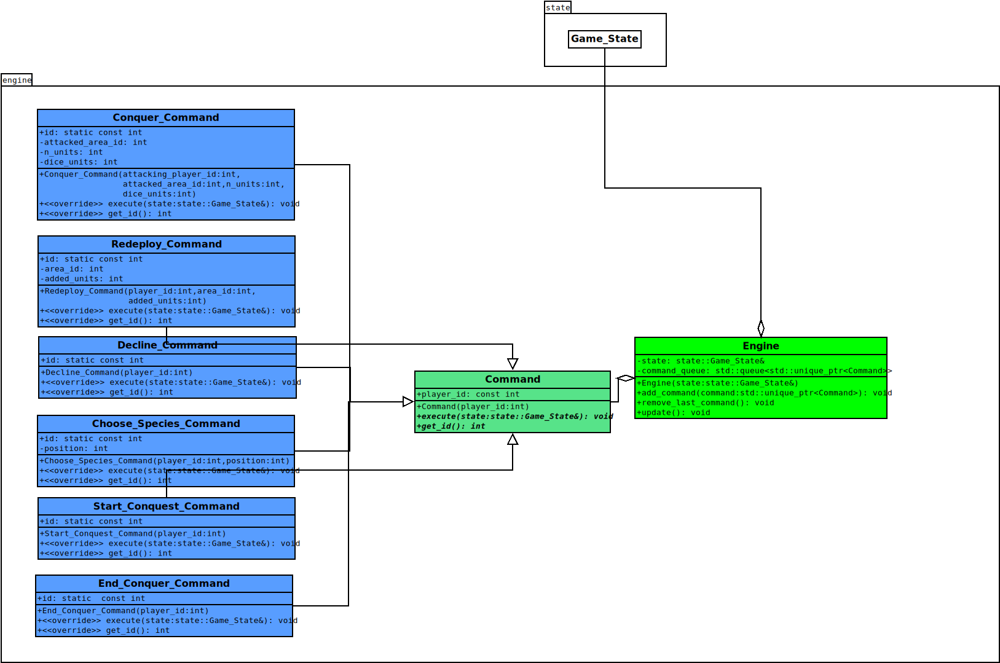

## 5 Intelligence Artificielle

Cette section est dédiée aux stratégies et outils développés pour créer un joueur artificiel. Ce robot doit utiliser les mêmes commandes qu'un joueur humain, ie utiliser les mêmes actions/ordres que ceux produit par le clavier ou la souris. Le robot ne doit pas avoir accès à plus information qu'un joueur humain. Comme pour les autres sections, commencez par présenter la stratégie, puis la conception logicielle.


### 5.1 Stratégies

Chaque IA repose sur une copie locale de l’état du jeu (state::Game_State), mise à jour après chaque action. Le moteur reste l’unique responsable de l’application des règles et des transitions d’état.

Trois niveaux d’intelligence sont implémentés :

une intelligence minimale aléatoire ;

une intelligence basée sur des heuristiques simples ;

une intelligence avancée reposant sur un arbre de recherche maximisant son gain par tour.


#### 5.1.1 Intelligence minimale

L’intelligence minimale correspond à une IA aléatoire. Elle ne cherche pas à optimiser ses décisions et se contente de produire des commandes valides du point de vue des règles du jeu. Ses décisions sont donc prises indépendamment les unes des autres, sans planification ni évaluation globale de la situation.
Pour perdre contre cette IA, il faut soit être extrêmement malchanceux soit très nul.


##### Phase Start

Cette phase très simple s'occupe des actions faisables en début de tour.

- Si l'IA ne possède pas de tribu active, elle choisit aléatoirement une espèce parmi les 5 accessibles dans la pile de jeu.
- Le cas échéant, elle choisit aléatoirement entre la phase de conquête et passer en déclin (Si elle passe en déclin, c'est comme si elle avait passé son tour).


##### Phase Conquer

Cette phase s'occupe des actions possibles une fois entré en phase conquête.

- Avec une certaine probabilité, l’IA met fin à la phase de conquête. Ici la probabilité n'est pas une chance sur deux comme pour la phase start pour des soucis d'équilibrage (On peut conquérir plusieurs area dans un tour de jeu et arrêter sa conquête sans avoir "écoulé" ses free units n'est jamais avantageux.)

- Dans le cas contraire, elle sélectionne aléatoirement une région attaquable.

- Enfin le nombre d’unités engagées correspond soit au coût requis, soit à l’ensemble des unités disponibles si celles-ci sont insuffisantes.


##### Phase Redeploy

Après la conquête, il faut défendre les areas conquises et c'est la phase redeploy qui va gérer ça.

- Une région redéployable est choisie aléatoirement.

- Un nombre d’unités aléatoire y est redéployé parmi les unités disponibles.

- Lorsque l’IA ne dispose plus d’unités libres, le tour prend fin.

Grâce à ces phases, on s'assure que l'IA envoie des commandes valides. Évidemment les décisions aléatoires seront dans la plupart des cas très peu optimales.
Cette IA garantit que toutes les actions sont valides, mais peut produire des décisions fortement sous-optimales.


#### 5.1.2 Intelligence basée sur des heuristiques

L’intelligence heuristique introduit des règles déterministes simples. Elle repose sur des heuristiques locales, sans anticipation des coups futurs. Elle reprend comme prévu la même forme que l'intelligence minimale.


##### Phase Start

- En l'absence de tribu active, l'IA choisit systématiquement la première tribu disponible dans la pile de Tribe. Ce faisant elle part avec un avantage de 5 pièces bonus selon les règles du jeu(4 pièces si on a choisi la seconde de la pile et ainsi de suite).

- Nous fixons un seuil de free units à partir duquel nous choisissons de passer la tribe en déclin. Ce seuil est de 3 car on considère que tout le potentiel de la tribu est gâché si nous avons que 3 unités pour conquérir. Il vaut mieux changer de tribe. En théorie ce seuil devrait se faire au cas par cas en fonction de la combinaison de species et power mais pour l'heuristique qui se veut simple on accepte ce compromis.

- Dans les autres cas, elle démarre la phase de conquête.


##### Phase Conquer

- Si aucune unité libre n’est disponible, l’IA met fin à la phase de conquête.

- Le cas échéant, elle sélectionne la région attaquable ayant le coût de conquête minimal.

- L’attaque est lancée avec le nombre d’unités approprié.

L'approche de cette heuristique est simple : maximiser les gains immédiats, mais sans gestion des tours suivants et donc des potentielles conséquences de ces choix, elle ne prend pas non plus en compte les effet de sa tribu lors du choix de la zone à conquérir.


##### Phase Redeploy

- L’IA identifie la région redéployable possédant le plus faible nombre d’unités.

- Une unité y est redéployée afin de renforcer la zone la plus vulnérable.

Cette IA a une approche de défense qui va globalement défendre ces zones uniformément. Cela apporte du déterminisme mais ce n'est pas la solution la plus optimale encore une fois car en théorie on voudrait que les zones proches des zones ennemies soit plus défendues.


#### 5.1.3 Intelligence basée sur les arbres de recherche

L’intelligence avancée repose sur une exploration récursive de séquences de conquêtes afin d’évaluer plusieurs scénarios possibles et de prendre une décision optimale.

Contrairement aux IA précédentes, elle ne va pas se limiter pas à une décision locale. Elle va chercher à estimer le gain global associé à une suite de commandes. 

Pour ce faire, l’IA s’appuie sur un moteur dédié (Engine_Ai), fonctionnant sur une copie indépendante de l’état du jeu. Ce moteur permet de simuler l’exécution de commandes sans impacter la partie "réelle". On va maintenant expliquer son fonctionnement.

À partir de l’état courant, l’IA explore récursivement les conquêtes possibles selon le principe suivant :

- Chaque nœud de l’arbre correspond à une commande de conquête simulée 

- L’exécution de cette commande est effectuée par le moteur de simulation 

- L’état résultant est évalué, puis utilisé comme point de départ pour les explorations suivantes 

- la récursion s’arrête lorsqu'il n’y a plus d’unités libres, lorsque la phase de redéploiement est atteinte, lorsqu'une conquête est jugée non rentable (afin de ne pas explorer les pistes trop mauvaises), or lorsque la profondeur atteint une valeur définit (par souci de complexité).

Chaque branche explorée est associée à une valeur numérique représentant le gain estimé, ainsi qu’à la séquence de commandes permettant d’atteindre cet état.


Une partie importante de cette IA repose sur la fonction d’évaluation ainsi que sur les critères d’arrêt de l’exploration.
Lors du tout premier appel de l’algorithme, l’IA mémorise plusieurs informations de référence issues de l’état courant du joueur comme la quantité d’or disponible et le nombre d’unités libres. Ces valeurs servent de référence de comparaison tout au long de l’exploration de l’arbre de recherche.

À chaque étape, après la simulation d’une conquête, l’état obtenu est analysé afin de déterminer si la poursuite de l’exploration est pertinente via une valeur. Cette valeur représente le rapport suivant :  units_used / money_gain qui est le rapport du coût sur le gain. C'est là que ça devient compliqué avec notre jeu, car certain pouvoir ont des effets n'impactant pas le coût ni l'argent gagné donc nous avons dû mettre un nombre magique sachant que quand aucune spécifité n'est présente, ce rapport vaut 2 (il faut 2 unités pour conquérir une zone vide et une zone rapporte une pièce). Ce rapport peut monter à 3 ou plus en fonction de la présence d'une montagne ou de troupe ennemies sur la zone. À l'inverse, un rapport de 1 ou 0.5 peut être présent quand on a un pouvoir donnant plus de pièces. En bref, on ne peut pas quantifier un rapport idéal car c'est trop variable et dépendant de nos pouvoirs. Ce qu'il faut comprendre c'est que plus ce rapport est faible, plus l'IA sera rapide car elle n'aura pas besoin d'évaluer les cas au-dessus de ce rapport.

Si le gain estimé est jugé trop faible au regard des ressources dépensées, la branche correspondante est donc considérée comme non rentable. Dans ce cas, l’exploration récursive est interrompue prématurément pour cette branche, ce qui permet d’éviter des simulations inutiles et de limiter la taille de l’arbre exploré. 
On a ici un compromis entre exhaustivité et performance, en concentrant l’exploration sur les potentiels meilleurs scénarios.

Lorsque l’exploration d’une branche s’arrête, l’état simulé est évalué globalement à l’aide du mécanisme de calcul des récompenses du moteur. La valeur obtenue est ensuite propagée vers les niveaux supérieurs de l’arbre, afin de permettre la comparaison entre les différentes séquences de conquêtes possibles. L’IA peut ainsi déterminer quelle suite de commandes maximise le gain attendu à partir de l’état initial.

Ce système d’évaluation progressive, couplé à des critères d’arrêt explicites, permet à l’intelligence artificielle de raisonner sur plusieurs coups à l’avance tout en conservant un temps de calcul plus faible. Malgré cela pour certaine espèce et pouvoir, le temps de calcul reste trop long passant d'une dizaine de secondes à une dizaine de minutes (voir plus).

C'est pourquoi nous avons rajouté une limite en profondeur dans la recherche afin que les combinaisons les plus couteuses en temps de calcul conservent un temps raisonnable (quelques secondes). 

Certaines conquêtes ne peuvent pas être réalisées de manière déterministe lorsque le nombre d’unités engagées est inférieur au coût requis. Dans ce cas, le moteur de jeu impose le recours à un lancer de dé afin de déterminer si la conquête aboutit. Ce dé est composé de six faces, dont trois faces vides, une face donnant un bonus de 1, une face donnant un bonus de 2 et une face donnant un bonus de 3. Le résultat du lancer ajoute "virtuellement" des troupes d'attaques et donc conditionne directement la réussite ou l’échec de la conquête.

Dans le cadre de l’intelligence artificielle basée sur les arbres de recherche, il est donc nécessaire de pondérer le gain lorsque le dé est utilisé.

Lorsque la conquête nécessite un certain nombre d’unités supplémentaires, l’IA évalue la probabilité que le lancer de dé fournisse un bonus suffisant pour combler ce manque. Cette probabilité est directement liée à la distribution des faces du dé et au nombre d’unités manquantes() :

- S'il manque une unité pour conquérir l'area, alors nous avons 3/6 en lançant le dé d'avoir le nombre requis.
- S'il manque deux unités, alors nous avons 2/6.
- S'il manque trois unités, alors nous avons 1/6.
C'est de là que vienne le 0.5,1/3 et 1/6 dans la méthode units_to_proba(int units).

Enfin, à l’issue de l’exploration l’IA conserve la séquence de commandes correspondant au meilleur gain estimé.
Cette séquence est stockée dans une pile interne et est consommée lors des appels successifs à give_command_Conquer. Nous avons bien finalement une seule commande à la fois, mais correspondant aux meilleurs coups trouvés.


##### Phase Start

Pour l'instant, il n'y a pas de méthode plus sophistiquée que l'intelligence heuristique pour la phase start. La seule chose qui change est le seuil d'unité restante pour partir en déclin qui cette fois dépend de la taille du nombre d'unité de base.

Il pourrait y avoir simulation d'un tour de jeu avec chaque espèce de la tribe_stack, afin de voir le gain réaliser sur 1 tour. Cela aurait cependant l'inconvénient de favoriser les tribus à gains d'argent (particulièrement ceux immédiats), par rapport aux tribus ayants des bonus défensifs.

##### Phase Conquer

Comme vu précédemment, lors du premier appel en phase de conquête, l’IA calcule la meilleure séquence de commandes possible à partir de l’état courant.
Les appels suivants retournent successivement les commandes pré-calculées jusqu’à épuisement de la séquence.

##### Phase Redeploy

Cette phase suit actuellement le redéployment de l'IA Heuristique.  
Nous avions travaillé sur une version prenant en compte la distance en coups en unité pour les adversaires non trop lointain (3 case maximum) afin de redéployer en priorité sur les areas proches d'eux.
Cette version n'est pas aboutie.


### 5.2 Conception logicielle

La conception logicielle des intelligences artificielles repose sur un principe fondamental : l’IA ne possède aucune logique de jeu propre. Elle ne fait que produire des commandes, exactement comme un joueur humain le ferait via l’interface. Toutes les règles, validations et transitions d’état sont centralisées dans le moteur du jeu.

Chaque IA manipule donc exclusivement :

- Une copie locale de l’état du jeu (state::Game_State),

- Un ensemble de commandes à envoyer au moteur (engine::Command),

- Un moteur de simulation dédié (pour l'IA avancée).

Cette séparation stricte garantit que l’IA ne triche pas (coup valide), et qu’elle reste interchangeable avec un joueur humain.

Toutes les intelligences artificielles héritent d’une interface commune (Ai_Interface). Cette interface définit les outils permettant au moteur de jeu d’interagir avec n’importe quelle IA de manière uniforme via un polymorphisme sur les méthodes suivante :

Cette interface impose notamment l’implémentation de méthodes correspondant aux différentes phases du tour :

- give_command_Start

- give_command_Conquer

- give_command_Redeploy

Chaque méthode de l’IA (give_command_Start, give_command_Conquer, give_command_Redeploy) retourne une commande unique, encapsulée dans un std::shared_ptr\<engine::Command>. L’utilisation d’un shared pointer répond à une problématique qu'on a rencontré pendant le développement.

Lorsqu’une commande est générée, elle peut être manipulée ou évaluée à différents niveaux du code avant d’être transmise au moteur global (Engine). Par exemple, certaines fonctions intermédiaires peuvent créer ou copier des commandes pour tester différents scénarios ou pour préparer la prochaine action du joueur. Le shared_ptr permet de maintenir la commande en vie tant que n’importe quel niveau du programme y fait référence, sans risque qu’elle soit détruite prématurément lorsque la fonction qui l’a créée retourne.
En somme cela nous permet de garantir une gestion mémoire et partagé entre les différents niveaux du code.


### 5.3 Conception logicielle: extension pour l'IA aléatoire/heuristique

Les IA minimale et heuristique partagent une conception logicielle simple et similaire. 

Chaque appel à une méthode give_command_* :

- analyse l’état courant,

- applique une règle locale (aléatoire ou heuristique),

- retourne immédiatement une commande.

Aucune mémoire des décisions précédentes n’est conservée, en dehors de l’état du jeu lui-même. Cela rend ces IA rapides mais prédictible ou incohérente.

La différence entre ces deux IA réside uniquement dans la politique de décision, et non dans l’architecture logicielle.
<!-- 
### 5.3 Conception logicielle: extension pour l'IA composée 
-->

### 5.4 Conception logicielle: extension pour IA avancée

L’intelligence artificielle avancée introduit une architecture plus complexe afin de permettre la planification multi-coups.

L’IA avancée repose sur un moteur dédié (Engine_Ai) distinct du moteur principal du jeu. Ce moteur fonctionne sur une copie indépendante de l’état du jeu et permet de faire les mêmes choses que l'Engine de base en ajoutant des commandes, les exécuter pour récupérer l'état résultant la commande mais sans jamais impacter la partie réelle.
Ce moteur de simulation est utilisé exclusivement lors de la phase de conquête, lorsque l’IA doit évaluer plusieurs scénarios possibles.

Lors du premier appel à give_command_Conquer, l’IA déclenche une exploration récursive de l’arbre des conquêtes possibles à partir de l’état courant.

Cette exploration retourne :

- une valeur numérique représentant le gain estimé,

- la séquence complète de commandes permettant d’atteindre cet état.

- Cette séquence est ensuite stockée dans une pile interne (command_stack).
Les appels suivants à give_command_Conquer se contentent de dépiler les commandes déjà calculées.

Ce choix architectural permet de respecter l’interface du moteur (une commande à la fois).

Lors de la simulation, certaines commandes peuvent s’avérer invalides (par exemple en raison d’un état intermédiaire incohérent). Ces erreurs sont capturées via des exceptions levées par le moteur de simulation. Lorsqu'une exception est levée, la commande fautive est retirée et donc la branche correspondante a cette commande est abandonnée. L'exploration se poursuit alors sur les autres branches

Ce mécanisme permet à l’IA avancée de rester robuste face aux cas limites sans compromettre l’ensemble de la recherche.


## 6 Client

### 6.1 Rôle du client

Jusqu'à maintenant, nous avons principalement discuté de la structure interne du jeu, en mettant l'accent sur la gestion de l'état, le moteur de jeu, le rendu graphique et l'intelligence artificielle. Cependant, pour permettre aux joueurs d'interagir avec le jeu, nous devons également développer un client.
Le client a pour rôle de fournir une interface utilisateur graphique (GUI) qui permet aux joueurs de visualiser l'état du jeu, d'envoyer des commandes au moteur de jeu et de recevoir des mises à jour en temps réel.

Il est important de comprendre comment nous avons choisi de structurer le jeu.

- L'engine possède une instance du Game_State qui représente l'état global du jeu. Celui-ci est mis à jour régulièrement grâce aux commandes envoyées par le client.
- Le client possède une copie locale du Game_State, et un renderer qui s'occupe d'afficher cet état à l'écran.

Le fonctionnement du client repose sur une boucle simple.
1. Récupération des évenements utilisateur (clics, touches, etc.) et actions en conséquence
2. Synchronisation de l'état du jeu avec celui de l'engine
3. Rendu de l'état du jeu à l'écran

Ces trois instructions permettent de créer une interface interactive où le joueur peut voir les changements dans le jeu en temps réel et interagir avec eux.

### 6.2 Description structurelle
#### 6.2.1 Gestion des évenements utilisateur
Pour gérer les évenements utilisateur, le client utilise la bibliothèque SFML qui fournit des outils pour capturer les entrées clavier et souris. Les évènements (les clics de souris dans notre cas) sont envoyés dans la classe Click_Handler qui va analyser la position du clic et déterminer quelle action doit être effectuée en fonction de l'état actuel du jeu.
Le Click_Handler peut effectuer différentes actions :
- Sélectionner une zone de la carte
- Ouvrir une fenêtre d'information pour les tribus
- Envoyer une commande au moteur de jeu
- etc...

#### 6.2.2 Mise à jour de l'état du jeu

Le client possède une instance du Game_State. Il est important de garder cette instance à jour pour que le rendu soit correct. Pour cela, le client fait une deep copy du state à l'intérieur de l'engine à chaque itération de la boucle principale. Ainsi, le client possède toujours une copie locale de l'état du jeu qui est synchronisée avec l'état global géré par le moteur de jeu.

La deep copy assure que le client ne modifie pas directement l'état global du jeu, ce qui pourrait entraîner des incohérences. Au lieu de cela, le client envoie des commandes au moteur de jeu pour effectuer des actions, et le moteur met à jour l'état global en conséquence.

#### 6.2.3 Rendu de l'état du jeu

Le rendu de l'état du jeu est effectué par la classe Renderer, qui utilise les différentes classes de rendu décrites précédemment (Map_Renderer, Player_Area_Renderer, Tribe_Stack_Renderer, etc.). Le Renderer prend la copie locale du Game_State et affiche les différentes composantes du jeu à l'écran.

### 6.3 Machine a états

Dans un jeu, on doit souvent être capable de gérer différents écrans (menu principal, écran de jeu, écran de pause, etc.). Pour cela, nous avons implémenté une machine à états dans le client. Cette machine a état permet différent types de jeu (mode solo, mode multijoueur, etc.) et le choix des caractéristiques des joueurs.

Pour un jeu local, les états sont :
1. Menu_State
2. Local_Lobby_State
3. Local_Game_State
4. Endgame_State
5. Menu_State

Pour un jeu multijoueur, les états sont : 

1. Menu_State
2. Online_Menu_State
3. Online_Lobby_State
4. Online_Game_State 
5. Endgame_State
6. Menu_State

Pour simplifier la gestion des clicks et des threads dans les états qui en ont besoin, des interfaces ont été créées : Clickable_State_Interface et Threaded_State_Interface.

Pour chaque, état, une classe dérivée de State_Interface est créée. Chaque état implémente les méthodes suivantes :
 - handle_input
 - render

Pour simplifier les étapes de rendering, Chaque état possède son propre renderer qui s'occupe d'afficher l'état à l'écran.

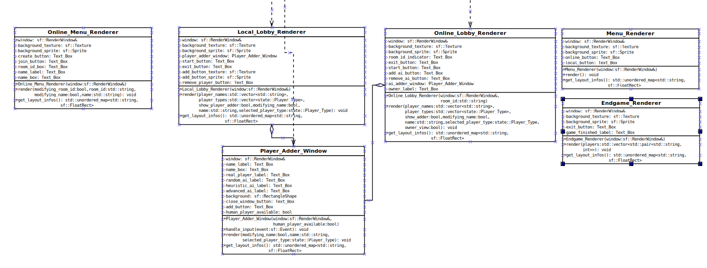

### 6.4 Diagramme UML

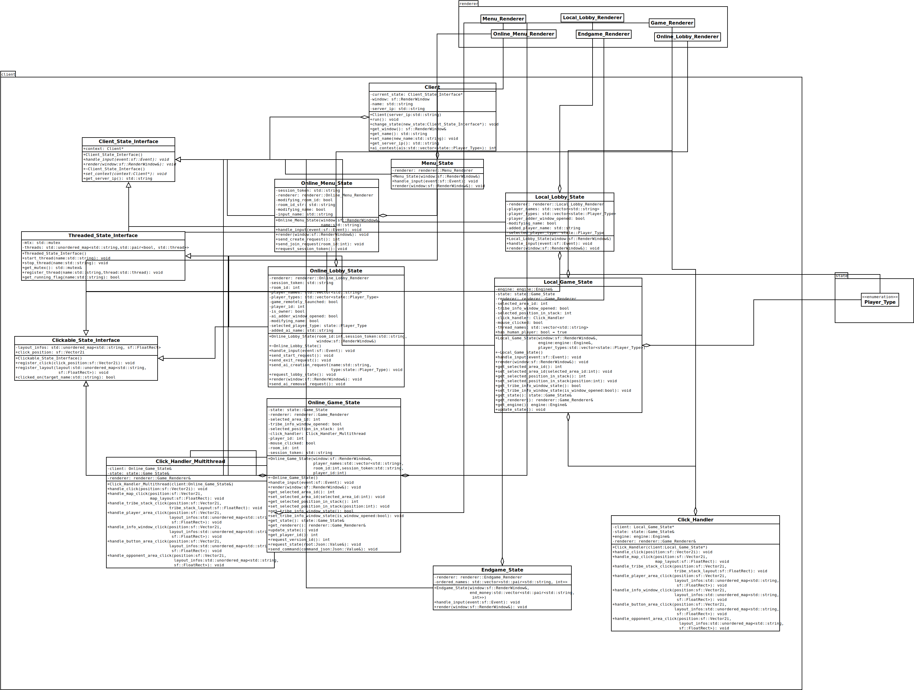

## 7 Multithreading
### 7.1 Rôle du multithreading
Afin de préparer l'implémentation du mode multijoueur en ligne, nous avons dû adapter notre architecture logicielle pour supporter le multithreading. Le but est de permettre au client et au serveur de fonctionner simultanément sans bloquer l'interface utilisateur.

### 7.2 Séparation Engine/Client
Pour cela, nous avons séparé le moteur de jeu (Engine) du client. Le moteur de jeu s'exécute dans un thread séparé, tandis que le client s'occupe de l'interface utilisateur dans le thread principal. 

Le thread de l'engine, dans sa boucle principale, effectue les opérations suivantes :
1. Traite les commandes reçues du client
2. Met à jour l'état du jeu

Le thread du client, dans sa boucle principale, effectue les opérations suivantes :

1. Récupère les évenements utilisateur
2. Synchronise l'état du jeu avec celui de l'engine
3. Rend l'état du jeu à l'écran

(Ce sont les mêmes étapes que précédemment)

Cette séparation permet au client de rester réactif même lorsque le moteur de jeu effectue des calculs intensifs.
Cela permet aussi d'avoir des fréquences de fonctionnement différentes entre le client et le serveur. Par exemple, le client peut fonctionner à 60 FPS pour un rendu fluide, tandis que le serveur peut fonctionner à une fréquence plus basse pour économiser des ressources.
### 7.3 Amélioration du client
Pour améliorer la réactivité du client, nous avons décidé de séparer les tâches du client en 2 threads distincts :

- un thread de synchronisation du Game_State
- un thread de gestion d'évènements utilisateur et de rendu

Cela permet notamment d'éviter que le rendu soit bloqué par la synchronisation de l'état du jeu (qui peut prendre un peu de temps)

### 7.5 Jeu des IA

Nous avons aussi décidé de faire tourner les IA dans des threads séparés. Chaque IA possède son propre thread qui s'occupe de générer les commandes à envoyer au moteur de jeu. De cette manière, nous n'avons pas de blocage du client lorsque l'IA effectue des calculs intensifs (notamment pour l'IA avancée).

### 7.5 Difficultés et solutions

La principale difficulté rencontrée lors de l'implémentation du multithreading a été la gestion de la synchronisation entre les threads. Pour éviter les conditions de course et garantir la cohérence des données, nous avons utilisé des mutex pour protéger l'accès aux ressources partagées (notamment le Game_State).

Il est très important pourchacun des threads de ne pas bloquer trop longtemps un mutex, sinon cela peut entraîner des ralentissements et une mauvaise réactivité de l'interface utilisateur.

## 8 Serveur

### 8.1 Rôle du serveur
Le serveur a pour rôle de gérer les parties multijoueurs en ligne. Il reçoit les commandes des clients, met à jour l'état du jeu en conséquence, et envoie les mises à jour aux clients connectés.
### 8.2 Fonctionnalités principales

Le serveur que nous avons développé possède les fonctionnalités suivantes :
- gestion des connexions des clients
- gestion des lobbies de jeu
- gestion des parties multijoueurs
### 8.3 Conception logicielle

Notre server fonctionne grâce à la librairie microhttpd qui permet de gérer les connexions HTTP de manière simple et efficace. Le serveur écoute les requêtes des clients, traite les commandes reçues, et envoie les réponses appropriées.

Pour faciliter la gestion des requêtes une architecture de "service" a été mise en place. Chaque service est responsable d'un type de requête spécifique. Dans notre cas, nous en avons deux :

- room_service pour la gestion des lobbies
- game_service pour la gestion des parties

Lorsqu'une requête arrive au serveur, le Service_Manager la redirige vers le service approprié en fonction de l'URL de la requête.

- /rooms/... -> envoyée au room_service

- /game/.... -> envoyée au game_service

La route est alors analysée par le service pour déterminer l'action à effectuer (création de lobby, connexion à un lobby, envoi de commande de jeu, etc.), le corps de la requête est récupéré et analysé (format JSON), puis l'action est effectuée en conséquence.

#### 8.3.1 Gestion des connexions

Le serveur gère les connexions des clients en utilisant des identifiants uniques pour chaque joueur. Lorsqu'un client se connecte au serveur, un nouvel identifiant est généré et envoyé au client. Cet identifiant est ensuite utilisé pour authentifier les requêtes du client.
Cela permet de définir quelles sont les actions que le client peut effectuer (par exemple, un client ne peut pas envoyer de commande de jeu s'il n'est pas connecté à un lobby).

Pour obtenir un identifiant, le client doit envoyer une requête à la route suivante :
- /connect : connexion au serveur et obtention d'un identifiant unique


#### 8.3.2 Gestion de lobby
Le serveur gère les lobbies de jeu, où les joueurs peuvent se connecter, choisir leurs paramètres de jeu, et attendre que tous les joueurs soient prêts avant de démarrer la partie. Une fois la partie lancée, le lobby est associé à une instance du moteur de jeu (Engine) qui gère l'état de la partie.

L'ensemble des routes disponibles à cet effet :
- /rooms/create : création d'un nouveau lobby
- /rooms/join/{room_id} : rejoindre un lobby existant
- /rooms/start/{room_id} : démarrer une partie
- /rooms/state/{room_id} : récupérer l'état d'un lobby
- /rooms/add_ai/{room_id} : ajouter une IA à un lobby
- /rooms/delete_ai/{room_id} : retirer une IA d'un lobby


#### 8.3.3 Gestion des parties

Le serveur gère les parties multijoueurs en ligne. Chaque partie est associée à une instance du moteur de jeu (Engine) qui gère l'état de la partie. Le serveur reçoit les commandes des clients, puis les transmet au moteur de jeu.

Ensemble des routes disponibles à cet effet :

- /game/command/{room_id} : envoyer une commande de jeu
- /game/state/{room_id} : récupérer l'état courant du jeu
- /game/version/{room_id} : récupérer la version courante de l'état du jeu

#### 8.3.4 Ajout du multithreading

Pour gérer efficacement les multiples connexions des clients et les différentes parties en cours, le serveur utilise le multithreading. Les différents threads sont les suivants :
- un thread principal qui écoute les connexions entrantes et redirige les requêtes vers les services appropriés (thread créé par microhttpd)
- un thread d'update de tous les engines
- un thread de nettoyage des clients inactifs
- un thread d'IA pour chaque partie contenant des IA

### 8.5 Modifications du Client

Pour permettre au client de communiquer avec le serveur, nous avons dû apporter quelques modifications à l'architecture du client. Notamment, nous avons ajouté une couche de communication réseau qui s'occupe d'envoyer les requêtes HTTP au serveur et de recevoir les réponses.

Pour pouvoir envoyer les commandes et recevoir un état du jeu, nous avons dû ajouter des méthodes de sérialisation/désérialisation JSON dans les classes concernées (Game_State, Command, etc.). Cela permet de convertir les objets C++ en format JSON pour les envoyer au serveur, et de convertir les réponses JSON du serveur en objets C++.

Le rendering dans le client a aussi été modifié pour que chaque joueur ait une vue qui soit "centrée" sur lui-même. Cela permet à chaque joueur de voir son propre état de jeu, sans avoir accès aux informations des autres joueurs (comme leurs tribus, leurs unités, etc.).

### 8.4 Diagramme UML

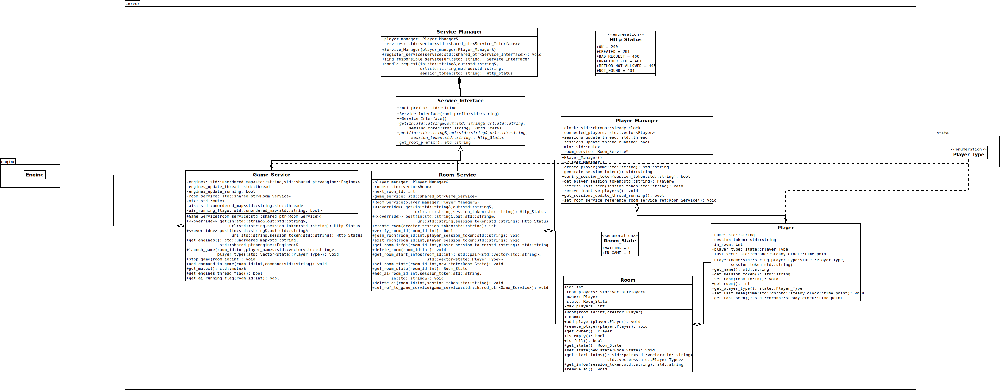