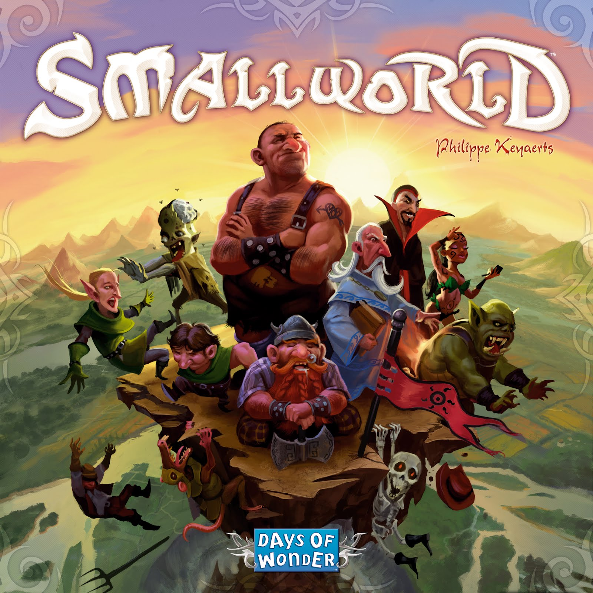
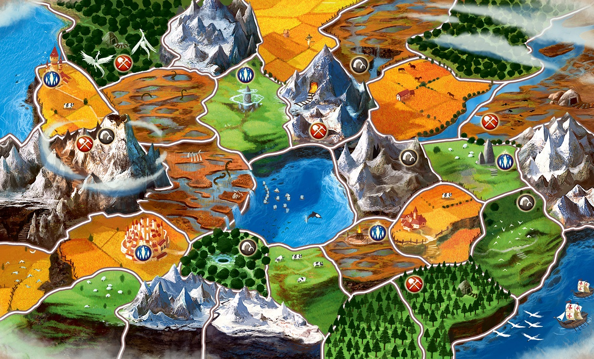
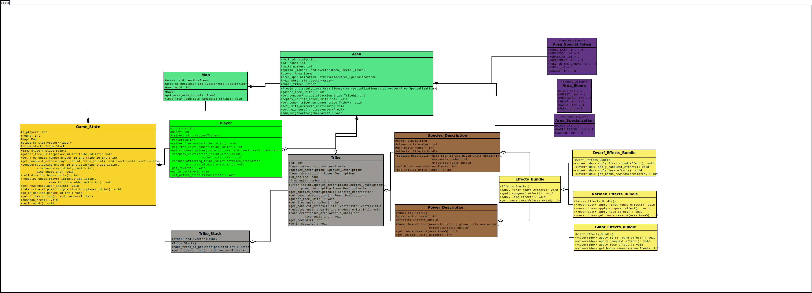
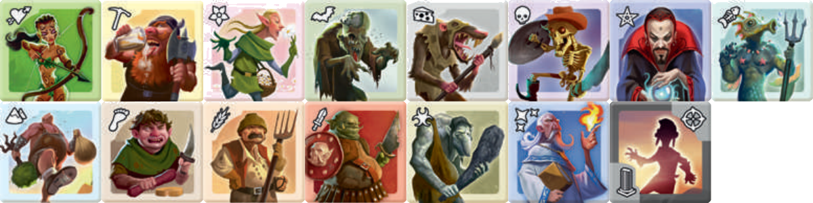
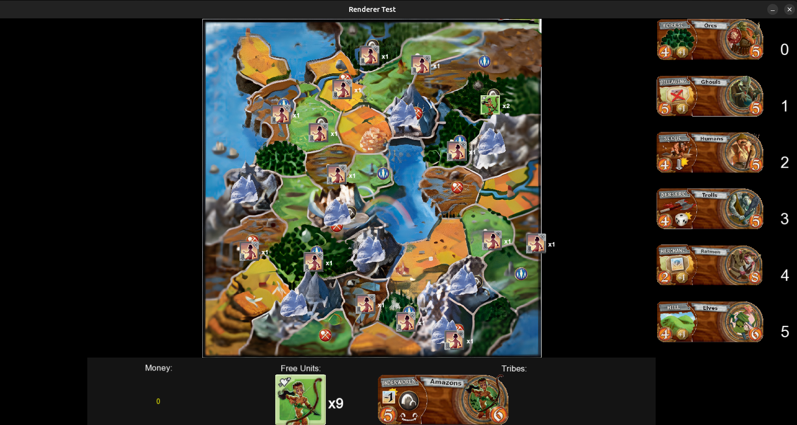
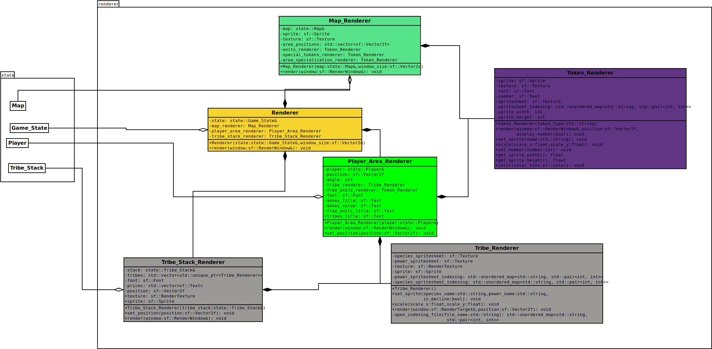

# Projet Logiciel Transversal: SmallWorld
---

#### Julien METZELARD – Tarek TALSI – Maël ARCHENAULT – Victor MOREL

---




## 1 Objectif

### 1.1 Présentation générale

L'objectif de ce projet est de créer une version numérique du jeu de plateau "SmallWorld". Le projet est mené par 4 étudiants. Le jeu est codé en C++.

### 1.2 Règles du jeu

Le jeu choisi est un jeu de stratégie en tour par tour. Pour gagner, les joueurs doivent avoir à la fin du jeu le plus d'argent.

SmallWorld se joue grâce à un plateau représentant une carte de territoires, et des pions faisant office de troupes. Lorsque son tour arrive, le joueur doit attaquer les territoires de ses adversaires afin de conquérir un maximum de terrain. A la fin de son tour, il reçoit autant d'argent que de terrains qu'il possède.




À ces mécaniques de bases s'ajoutent des systèmes de pouvoirs. Chaque joueur choisit une "espèce" pour ses troupes ainsi qu'un "pouvoir". Les combinaisons espèce/pouvoir sont définies de manière aléatoire. Chaque espèce a un effet différent, de même pour les pouvoirs. Cela peut aller d'un bonus de troupes lors d'un attaque à un bonus de récompense à la fin du tour. Les pouvoirs sont très variés.

Chaque joueur peut, s'il le veut, abandonner son espèce actuelle et en prendre une nouvelle. L'espèce abandonnée reste sur le plateau, mais est marquée comme "en déclin". Les territoires occupés par une espèce en déclin rapportent toujours des récompenses à son ancien propriétaire.

Tout l'intérêt du jeu réside dans la capacité à changer d'espèce au bon moment, et à choisir la bonne combinaison espèce/pouvoir parmi celles proposées.


### 1.3 Conception Logiciel
Présenter ici les packages de votre solution, ainsi que leurs dépendances.


## 2 Description et conception des états

### 2.1 Description des états

L’état global du jeu est centralisé dans la classe Game_State, qui contient toutes les informations nécessaires pour décrire la partie à un instant donné :

- la carte (Map) contenant l’ensemble des informations sur les zones de la carte avec ses specificités ainsi que les troupes des joueurs,
- la liste des joueurs (Player),
- les tribus (combinaison d'espèce et de pouvoir) disponibles via une pile (Tribe_Stack),
- des paramètres de gestion de tour comme le nombre de joueur actif ainsi que le nombre de rounds.

Chaque Player représente un joueur de la partie et possède :

- un identifiant unique,
- un ensemble de tribus actives qu’il contrôle,
- un compteur de points de victoire accumulés,
- les méthodes associées à la conquête ou au déploiement d’unités.

Une Tribe correspond à la combinaison d’une espèce et d’un pouvoir spécial, ce qui définit les capacités et bonus de la tribu. Chaque tribu possède :

- un nombre d’unités disponibles,
- des descriptions (Species_Description, Power_Description) déterminant ses effets,
- des méthodes associé aux tribes comme go_in_decline et autre qui seront explicités plus tard.

Les zones (Area) modélisent les régions de la carte. Elles contiennent :

- un biome (Area_Biome) et éventuellement des spécial tokens (forteresse, tanière, etc.),
- une liste de voisins, pour représenter les connexions de la carte,
- un propriétaire (Tribe), ici il est important que le propriétaire soit une Tribe et non pas un Player car un Player peut avoir plusieurs Tribe et que ces Tribe peuvent s'attaquer mutuellement,
- et des méthodes permettant la conquête ou le déploiement d’unités.

L’ensemble de ces zones est géré par la classe Map, qui stocke leur liste et permet le chargement depuis un fichier JSON (utilisé pour initialiser la carte).

Enfin, les effets spéciaux sont gérés par la hiérarchie Effects_Bundle :

- La classe abstraite Effects_Bundle définit une interface générique (apply_first_round_effect, apply_conquest_effect, etc.).
- Des classes concrètes comme Dwarf_Effects_Bundle, Ratmen_Effects_Bundle ou Giant_Effects_Bundle héritent de cette interface pour appliquer des bonus spécifiques. Il est important de préciser que le diagramme UML actuel ne contient pas toutes les classes concrètes car chacune d'entre-elles "viole" les règles du jeu ce qui complique leur implémentation.


### 2.2 Conception logicielle

Le diagramme UML présente l’architecture des classes du module state.
L’organisation suit une approche orientée objet modulaire (plus que cruciale dans notre cas avec autant d'effet différent) :

- Game_State joue le rôle de façade, offrant un point d’entrée unique pour manipuler l’état global du jeu.
- Map et Area forment le modèle spatial, décrivant la topologie/état physique du monde.
- Player et Tribe constituent le modèle des acteurs de ce monde, reliés entre eux par composition.
- Species_Description, Power_Description et Effects_Bundle réalisent le modèle des caractéristiques et utilisent une hiérarchie d’héritage pour encapsuler les comportements spécifiques à chaque race ou pouvoir.

L'architecture du système centralise l'état global du jeu dans la classe Game_State, qui regroupe toutes les informations essentielles pour décrire la partie à un moment donné ce qui en fait une facade qui sera utile pour la suite. La carte (Map) agrège plusieurs zones (Area) connectées entre elles, offrant ainsi une structure modulaire qui reflète la topologie du monde de jeu. Cette modulation potentielle est importante car la map n'est pas un objet fixé sans modification. Des special token venant de pouvoir de classe modifient cette map. La classe contient également la liste des joueurs (Player), ainsi que les tribus, qui combinent espèces et pouvoirs, accessibles via une pile (Tribe_Stack). En outre, des paramètres de gestion des tours, tels que le nombre de joueurs actifs et le nombre de rounds, sont également inclus, garantissant une interface pour la manipulation de l'état du jeu. La hiérarchie d'Effects_Bundle encapsule divers comportements d'effets appliqués aux tribus, permettant une flexibilité dans la gestion des capacités spécifiques comme vu précedemment.


### 2.3 Conception logicielle: extension pour le rendu

Comme vu avec nos encadrants, l’architecture du module state est conçue pour être indépendante de l'engine.
Les classes ne contiennent aucune logique d’affichage ni de physique pur du jeu ; elles ne stockent que des données et des états.
L'intérêt de cette séparation est de ne pas exposer la structure interne de notre state dans le cas où ne serions amené à changer quelque chose, il ne faut pas que ces changements impactent la façon dont l'engine appele le state.
Le module de rendu peut donc interagir avec cet état via des interfaces de lecture (ex. : positions des tribus, nombre d’unités sur chaque zone, propriétaire d’une zone, etc) sans altérer la logique du jeu.


### 2.4 Conception logicielle: extension pour le moteur de jeu

Le moteur de jeu utilise le module state comme base de données dynamique.
Il peut :

- appeler les méthodes Game_State::conquer(), Player::redeploy_units(), ou Area::set_owner() pour faire évoluer la partie,
- interroger l’état courant pour déterminer les actions possibles,
- notifier le module de rendu pour mettre à jour l’affichage.

Cette conception permet une séparation claire entre la logique du jeu et les actions du joueur qui par ailleurs rend le projet facilement testable via des tests unitaires.

### 2.5 Ressources




 
## 3 Rendu: Stratégie et Conception
### 3.1 Stratégie de rendu d'un état

Le jeu possède différentes structures assez différentes à afficher:
- **la carte de jeu** : Map
- **les pions posés sur les territoires** : Units, Special_Tokens, etc ...
- **la pioche d'espèce** : Tribe_Stack
- **la main du joueur** : Money, Free_Units, Tribes

Pour afficher ces différentes structures, nous avons choisi de créer une classe Renderer qui va s'occuper de tout le rendu graphique du jeu. Cette classe va utiliser la bibliothèque SFML pour afficher les différentes structures du jeu.

Chaque structure va avoir une classe dédiée à son affichage. Cela permettra une meilleure organisation du code et une meilleure réutilisabilité.

### 3.2 Conception logicielle

Voici une description des classes principales utilisées pour le rendu:

### Token_Renderer  

Cette classe est responsable du rendu des tokens (unités, special tokens, area_specialization) sur la carte. C'est une brique de base utilisée dans d'autres classes de rendu (Map_Renderer et Player_Area_Renderer)

Avant de rendre l'objet sur une fenêtre de rendu, on peut changer ce qu'il représente:

- pour des pions: l'espèce sur le pion
- pour des special_tokens: le type de special_tokens
- pour des area_specialization: le type d'area_specialization

Il est aussi possible d'ajouter un nombre sur le côté de l'affichage du pion pour représenter le nombre d'unités présentes sur la zone.

### Tribe Renderer  

Cette classe est responsable du rendu des tribes. Une tribe est affichée grâce à deux cartes:

- une carte de pouvoir
- une carte d'espèce

Ce moteur de rendu est capable de rendre l'ensemble des deux cartes (en les fixant l'une par rapport à l'autre).


### Map Renderer  

Cette classe est responsable du rendu de la carte de jeu. Elle utilise la classe Token_Renderer pour afficher les unités et les special tokens sur chaque zone de la carte.

La carte de jeu est stockée sous la forme d'une image associée avec un fichier json représentant les positions des différentes zones.
Le rendu de la carte se fait en deux étapes:
- on affiche l'image de la carte
- on affiche les unités et les special tokens sur chaque zone grâce à la classe Token_Renderer

### Player Area Renderer  

Cette classe est responsable du rendu de la main d'un joueur donné. Elle utilise la classe Token_Renderer pour afficher les unités que le joueur possède dans sa main. De même la classe Tribe_Renderer est utilisée pour afficher les tribes que le joueur possède.

La classe Player_Area_Renderer possède une référence vers la Map qu'elle affiche.

Trois choses sont affichées par ce moteur de rendu:
- l'argent du joueur
- les unités libres du joueur
- les tribus que le joueur possède (dont celles en déclin)


### Tribe Stack Renderer  

Cette classe est responsable du rendu de la pioche d'espèces. Elle utilise la classe Tribe_Renderer pour afficher les tribus disponibles dans la pioche.

La classe Tribe_Stack_Renderer possède une référence vers la Tribe_Stack qu'elle affiche.

Ce moteur de rendu afficher les 6 tribus de la pioche auquel le joueur a accès. Il ajoute à leur côté le prix de retrait de la tribu.

### Renderer  

Cette classe est responsable du rendu global du jeu. Elle utilise les différentes classes de rendu pour afficher l'état actuel du jeu.


### 3.3 Conception logicielle: extension pour les animations

Pas d'animations implémentées.


### 3.4 Ressources

L'ensemble des ressources est stockée sous forme de spritesheet. Les classe s'occupent ensuite de d'afficher seulement une partie rognée de la spritesheet. Pour cela, elles s'aident de fichier nommes "indexing" qui leur indiquent où trouver chaque sprite dans la spritesheet.




Exemple de fichier de type "indexing"

```json
{
  "sprite_size": [150, 150],
  "frames": {
    "Amazons":  [0,0],
    "Dwarves":  [0,1],
    "Elves":  [0,2],
    "Ghouls": [0,3],
    "Ratmen":  [0,4],
    "Skeletons":  [0,5],
    "Sorcerers":  [0,6],
    "Tritons":  [0,7],
    "Giants":  [1,0],
    "Halflings":  [1,1],
    "Humans":  [1,2]    ,
    "Orcs": [1,3],
    "Trolls":  [1,4],
    "Wizards":  [1,5],
    "Lost Tribe":  [1,6]
  }
}
```

### 3.5 Exemple de rendu

A l'aide de la classe Renderer, il est possible de rendre l'état complet du jeu.






<!-- ## 4 Règles de changement d'états et moteur de jeu
Dans cette section, il faut présenter les événements qui peuvent faire passer d'un état à un autre. Il faut également décrire les aspects liés au temps, comme la chronologie des événements et les aspects de synchronisation. Une fois ceci présenté, on propose une conception logicielle pour pouvoir mettre en œuvre ces règles, autrement dit le moteur de jeu.

### 4.1 Horloge globale

### 4.2 Changements extérieurs

### 4.3 Changements autonomes

### 4.4 Conception logicielle

### 4.5 Conception logicielle: extension pour l'IA

### 4.6 Conception logicielle: extension pour la parallélisation

Illustration 3: Diagrammes des classes pour le moteur de jeu


## 5 Intelligence Artificielle
Cette section est dédiée aux stratégies et outils développés pour créer un joueur artificiel. Ce robot doit utiliser les mêmes commandes qu'un joueur humain, ie utiliser les mêmes actions/ordres que ceux produit par le clavier ou la souris. Le robot ne doit pas avoir accès à plus information qu'un joueur humain. Comme pour les autres sections, commencez par présenter la stratégie, puis la conception logicielle.
### 5.1 Stratégies

#### 5.1.1 Intelligence minimale

#### 5.1.2 Intelligence basée sur des heuristiques

#### 5.1.3 Intelligence basée sur les arbres de recherche

### 5.2 Conception logicielle

### 5.3 Conception logicielle: extension pour l'IA composée

### 5.4 Conception logicielle: extension pour IA avancée

### 5.5 Conception logicielle: extension pour la parallélisation


## 6 Modularisation
Cette section se concentre sur la répartition des différents modules du jeu dans différents processus. Deux niveaux doivent être considérés. Le premier est la répartition des modules sur différents threads. Notons bien que ce qui est attendu est un parallélisation maximale des traitements: il faut bien démontrer que l'intersection des processus communs ou bloquant est minimale. Le deuxième niveau est la répartition des modules sur différentes machines, via une interface réseau. Dans tous les cas, motivez vos choix, et indiquez également les latences qui en résulte.

### 6.1 Organisation des modules

#### 6.1.1 Répartition sur différents threads

#### 6.1.2 Répartition sur différentes machines

### 6.2 Conception logiciel

### 6.3 Conception logiciel: extension réseau

### 6.4 Conception logiciel: client Android

Illustration 4: Diagramme de classes pour la modularisation -->
